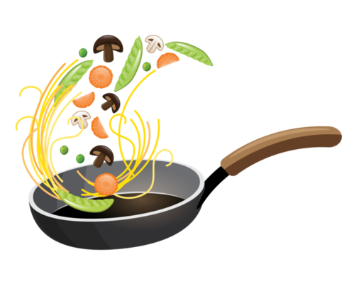

# 🍰 ¿Qué Voy a Comer Hoy? Recetas Visuales con Python, OpenAI y Streamlit

## Descripción

En esta sesión, exploraremos cómo usar Python junto con OpenAI y Meta AI para generar recetas visuales en una aplicación de Streamlit. Veremos cómo estas tecnologías pueden sugerir recetas dinámicas adaptadas a tus preferencias y momentos del día, con un enfoque en recetas chilenas, saludables, veganas y festivas.

